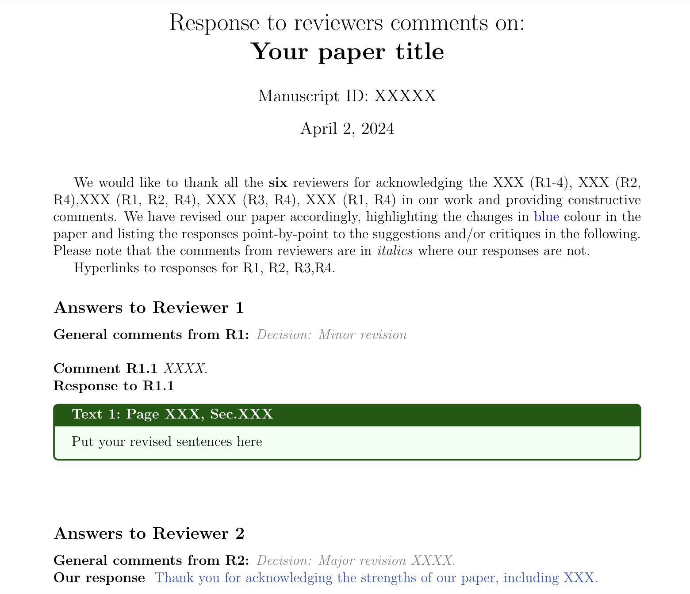

# Journal Response Letter Template

Responding to peer reviewer comments can often be a daunting task, especially when the comments are extensive. This repository contains templates designed to assist you in crafting responses to reviewer comments effectively. The features of this repository aim to streamline the process and make it more efficient for you.

## Features

1. **Hyperlink Navigation**: Easily navigate to a specific reviewer's response section by clicking on hyperlinks.
2. **Automatic Numbering**: Reviewer's questions and your responses are automatically numbered for clarity and organization.
3. **Revised Text Box**: A dedicated section to include your revised text, saving reviewers time by providing them with immediate access to your changes.

## Example

## How to Use

1. **Clone the Repository**: Clone this repository to your local machine using Git.

## Contributing
If you have suggestions for improvements or additional features, feel free to fork this repository and submit a pull request. Your contributions are highly appreciated.

## License
This project is licensed under the MIT License, which means you are free to use, modify, and distribute the templates for personal or commercial purposes. However, attribution is always appreciated.

### Author:
Chen (Cherise) Chen
2024

### Acknowledgement: 
The document was polished with ChatGPT 3.5.